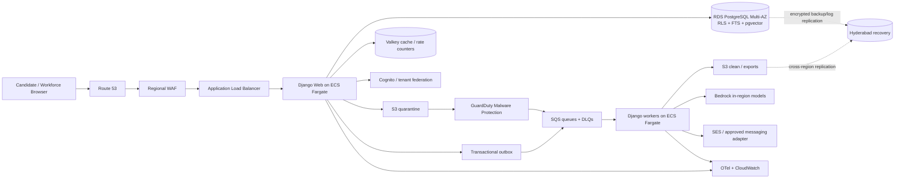

# Implementation Plan: Integrated Recruiter and Candidate Workflows

## FM4 transitional security clarification — 2026-10-01

The separately authorized comparison extension reuses the same table with a
distinct `comparison-selection` kind. Ordered IDs are encrypted and source-result
bound. Replace requires If-Match (409 on stale); no arbitrary return URL is accepted.
POST return issues a separate results-bound token and a server-generated route.
The legacy comparison UI and final comparison endpoint stay unchanged in purpose.
FM6 may reuse this typed transport or simplify it only with equivalent session,
authorization, order, concurrency, refresh and storage-absence evidence. It must
not become a generic client session store. FM4-R04–R06 gate the integration.

Use a dedicated `SearchWorkflowHandoff`; existing WorkflowRun checkpoints are
deliberately minimized hashes and must not become arbitrary client session storage.
Only validated criteria or an authorized persisted search reference is encrypted
with existing versioned application field keys. Fifteen-minute records bind tenant,
actor, session credential/session-key hash, target type and source version. Opaque
256-bit random tokens appear only in navigation fragments and API request headers;
only their SHA-256 hashes are persisted. Never log fragments, headers or payloads.
Retries serialize by session credential and reuse one record, rotating the bearer
instead of storing token-bearing responses in generic idempotency storage.

Every restore revalidates live session, membership, role, ownership, opening/team
scope, source version, state and expiry. Restore returns no candidate rows and
does not execute a search. A separate authorized read displays existing snapshots
after current visibility/consent checks. Criteria completion is transactional with
results handoff creation; stale review revisions require an ETag. Expired cleanup
is explicitly tenant-scoped. All responses are private/no-store and rate limited.

FM4-R01–R03 gate FM4 continuation. Legacy criteria/results remain imperative UI
with exclusive DOM ownership. FM5/FM6 may simplify transport once both destinations
are migrated, but must retain server authorization and remove unused endpoints only
after compatibility tests. This is not a generic persistence service. No production
React route is enabled by this clarification.

**Branch**: `001-recruiter-candidate-workflows` | **Date**: 2026-09-28 | **Spec**: [spec.md](./spec.md)

**Input**: Approved specification, project constitution, and read-only visual/functional baseline `enter_recruiter_recruiter_candidate_ux.html`.

**Planning constraint**: This artifact describes implementation only. No application code or existing HTML was modified.

## Approved frontend architecture amendment (2026-10-01)

React + TypeScript + Tailwind through the existing Vite pipeline are approved for all user-facing pages. Django/DRF retain URLs, session, CSRF, authentication, authorization, validation, business logic, audit and database authority. The detailed [frontend migration plan](./frontend-migration.md) is normative for FM1–FM14, including WIP inventory, exact routes, components, APIs, design tokens, state/accessibility tests, fallback and rollback. This supersedes earlier server-rendered-only/no-framework statements below; historical infrastructure and AI plans do not authorize work during migration. Phase 10 remains deferred until FM14-03.

Only three scope additions are approved: signed-out chooser at / using existing OIDC, public jobs at /jobs/ using a minimum published-opening GET collection, and backend recent-search GET list/criteria restoration using existing models. All other backend APIs/models remain unchanged. Every route retains a verified Django/legacy fallback until its replacement passes functional, security, accessibility and visual gates. Original mockup stays immutable; production privacy/security/accessibility controls take precedence. No protected browser storage and no shared React/imperative DOM ownership are permitted.

## Summary

### FM3 public-opening security clarification (2026-10-01)

Independent-publication remediation (explicit owner approval): extend the existing
projection service with authenticated GET `publication`, POST `publication/publish`
and POST `publication/withdraw` under the tenant opening. GET is read-only and
returns separate internal/public states, exact allowlisted preview, ETag/source and
projection versions, and an opaque keyed digest bound to tenant, opening, versions
and public values. Publication time is server-assigned on confirmation (pending in
preview). POST requires literal boolean confirmation, If-Match and Idempotency-Key;
publish also requires the current digest. Lock/revalidate membership and source,
enforce opening.write scope before idempotent replay, and scope replay by actor,
tenant, object, action, body and If-Match. Decisions advance the source version;
projection version records that revision. Neither OPEN, reopening nor source edits
publish: source-change triggers invalidate old publication until fresh confirmation.
Withdrawal leaves internal state unchanged. Atomic audit/projection/source writes
never commit proposed unconfirmed values. On rollback only an unchanged previously
confirmed source/projection can remain. Migration 0014 adds projection version only.
Compact legacy controls include a separately labelled internal OPEN action and native
confirmation dialogs; no React cutover, RLS policy changes, FM4 or redesign.

Explicitly authorized security correction: anonymous discovery reads a separate
`PublicOpeningProjection`, never `recruiting_opening`. The source table's forced
tenant RLS and policies remain unchanged. An additive migration must install the
projection, private source linkage, and a non-login, non-owner, non-BYPASSRLS
public reader with SELECT only. The endpoint must assume that restricted role;
superuser development results are not security evidence. Public SELECT is limited
to published, active, non-expired projections. Publication requires existing
opening-write authorization and explicit active publication; withdrawal/source
invalidation and projection updates are transactional and audited without values.
No existing opening is automatically backfilled into public discovery.

The public UUID is distinct from the internal opening UUID. Public responses may
contain only approved publication fields, never tenant/source IDs, teams, contact
details, candidate information or private requirements. Optional company,
experience and skills are omitted unless explicitly configured for publication.
Public role pages resolve that public UUID; authenticated applications still
perform existing consent, ownership, eligibility and duplicate checks against
the authoritative source. Publication failure must roll back, and direct source
changes must invalidate an old projection rather than leave stale public data.
Anonymous list/detail reads require bounded pagination, rate limits, non-enumerating
errors and no-store caching. This is attached to FM3, not FM4 or Phase 10.

Turn the approved single-file recruiter/candidate mockup into an India-only production web application while preserving its information architecture, visuals, interactions, and supported workflows. Use a Django modular monolith with server-rendered templates and small TypeScript modules, PostgreSQL/RLS/pgvector, Cognito, S3 quarantine and malware scanning, SQS/outbox workers, and ECS Fargate in Mumbai with warm recovery infrastructure in Hyderabad.

The architecture deliberately keeps transactional, privacy, authorization, and audit decisions together. AI is an optional, bounded assistant for resume-field suggestions, search interpretation, semantic retrieval, and cited explanations; deterministic code and humans remain authoritative. Optional-service failure degrades to manual or pending states, while identity, authorization, primary-data, and file-security failures close access.

## Technical Context

**Language/Version**: Python 3.13; TypeScript 5.x for browser modules; SQL; Terraform HCL  
**Primary Dependencies**: Django 5.2 LTS, Django REST Framework, psycopg 3, Pydantic 2 for AI/event schemas, LangGraph, boto3, OpenTelemetry, Vite  
**Storage**: Amazon RDS for PostgreSQL 16 with `pgvector`, `pg_trgm`, full-text search, and RLS; S3 quarantine/clean/export/audit buckets; ElastiCache Serverless for ephemeral caches and rate counters  
**Testing**: pytest/pytest-django, Hypothesis, Playwright, axe-core, contract/schema tests, k6 or Locust load tests, OWASP ZAP, AI evaluation datasets  
**Target Platform**: Responsive web, current and previous major Chrome/Edge/Firefox/Safari; Linux containers on AWS ECS Fargate; primary `ap-south-1`, recovery `ap-south-2`  
**Project Type**: Server-rendered web application with same-codebase API and asynchronous workers  
**Performance Goals**: Normal search <=3 seconds p95 at launch load; interaction feedback <=1 second for local/accepted actions; asynchronous work acknowledges quickly and exposes state  
**Constraints**: 99.9% monthly availability; 15-minute RPO; four-hour RTO; 35-day encrypted backups; WCAG 2.2 AA; 320 CSS pixels through desktop; India-only candidate-content processing; fail-closed protected operations; no pre-scan resume access  
**Scale/Scope**: 100 tenants, 1 million candidate profiles, 1,000 concurrent active users; five fixed roles; seven specified end-to-end user stories and the mockup’s current screens/workflows

## Constitution Check

*GATE: Evaluated before Phase 0 and re-evaluated after Phase 1 design.*

| Principle / gate | Plan response | Pre-research | Post-design |
|---|---|---:|---:|
| Accessibility by Default | Server rendering, semantic baseline, progressive enhancement, axe plus manual keyboard/screen-reader/zoom gates | Pass | Pass |
| Responsive and Resilient Interfaces | Preserve approved CSS/layout; regression at 320–1440px, long content, touch/pointer, reduced motion | Pass | Pass |
| Candidate Data Is Private by Design | Consent/visibility grants, RLS, encryption, minimized logs/events/AI, lifecycle deletion and negative tests | Pass | Pass |
| Clear, Human-Centred Workflows | Explicit loading/empty/success/failure/conflict/pending states and manual fallbacks | Pass | Pass |
| Maintainable Simplicity | Modular monolith, one source database, no SPA/microservices/OpenSearch at launch, dependency rationale recorded | Pass | Pass |
| Evidence-Based Testing | Layered deterministic, authorization, privacy, accessibility, browser, recovery, load, and AI evaluation gates | Pass | Pass |
| Preserve Existing Functionality | Mockup is read-only baseline; workflow inventory, golden screenshots, contract and E2E regression before extraction | Pass | Pass |

No constitution exception is required. Production acceptance remains blocked until legal/privacy/security/accessibility/performance/recovery gates in this plan have evidence.

## Architecture and Stack Decisions



### Architectural style

- **Modular monolith**: one repository, one Django deployment artifact, one worker artifact from the same code, and explicit domain modules. Modules communicate through service interfaces and transactional events, not direct cross-module table mutation.
- **Django-hosted React UI**: migrate one page at a time to React/TypeScript and shared Tailwind components using Django bootstrap and the existing Vite manifest. Retain verified legacy templates/entries behind per-route server flags until acceptance passes; separate DOM ownership and styles.
- **Same-origin API**: JSON REST under `/api/v1` for async interaction; OpenAPI 3.1 is the interface contract. Secure cookie sessions plus CSRF avoid browser token storage.
- **One transactional source**: PostgreSQL owns candidate, application, consent, status, audit, outbox, and workflow state. Search projections are derived and disposable.
- **Managed infrastructure**: AWS services carry identity, load balancing, files, queues, email, keys, secrets, monitoring, and malware scanning; the team owns domain behavior.

### Stack rationale

Django 5.2 is LTS and fits the existing server-rendered design. PostgreSQL supports transactional relations, RLS, full-text/trigram search, and vectors without copying sensitive data into a separate engine. ECS Fargate avoids Kubernetes administration. Terraform makes the Mumbai/Hyderabad recovery environment reproducible. A browser framework is not justified unless future measurement proves the server-rendered interaction model cannot meet a documented workflow.

Detailed decisions and rejected alternatives are in [research.md](./research.md).

## Application Modules

| Module | Responsibility | Hard boundary |
|---|---|---|
| `identity` | Cognito/OIDC callback, session assurance, verified-email linking, sign-out | No domain authorization from IdP groups alone |
| `tenancy` | Platform-provisioned company tenants, business units, memberships, fixed roles, object/team scope, tenant switching | Exactly one effective tenant per request; business units never become isolation boundaries |
| `candidate` | Candidate profile, employment history, links, candidate-controlled edits, consent/visibility, resume quarantine/review, generic derived findings, and profile lifecycle | Global profile is not tenant-owned; no resume read before clean tag; candidate corrections invalidate findings/search/cache immediately |
| `recruiting` | Business units/openings, applications, recruiter-entered synthetic candidates, sourced-candidate work records, internal status, candidate-status preview/confirm, contextual notes, contact/share, shortlist, and compare | Tenant scoped; candidate-work and application records link without merging; private notes never candidate-visible; informational findings never cause a recruiting action |
| `search` | Typed criteria, strict filtering, hybrid retrieval, ranking, cited evidence, and authorized informational-finding projection | Authorize before retrieve/rank; findings are projected after ranking and never enter score, eligibility, or ordering |
| `ai` | Model gateway, prompts/schemas, embeddings, evaluations | No auth, consent, autonomous write, or consequential decision |
| `communications` | Template rendering, channel consent, queued delivery, visible status | External send occurs after commit and is idempotent |
| `privacy` | Self-service rights center, access/correction, withdrawal/hiding, 24-hour exports, deletion, inactivity renewal, legal holds | Immediate hiding is separate from bounded erasure; erasure covers source and derived stores |
| `audit` | Append-only application audit, hash checkpoints, query/redaction policy | No candidate content in audit body |
| `abuse` | Identity/network rate limits, anomaly tightening, override workflow | Temporary delays only; generic public errors |
| `operations` | Outbox, scheduled jobs, health/readiness, reconciliation | Missing scope/config fails closed |

The logical data model, invariants, indexes, lifecycle, and state machines are in [data-model.md](./data-model.md).

## Authentication, Roles, Tenant Isolation, and Auditing

### Authentication

- Candidate: verified-email passwordless OTP through Cognito; OTP responses resist enumeration and obey identity/network limits.
- Workforce: tenant SAML/OIDC federation when available; MFA required; fallback Cognito workforce accounts are exception-managed.
- Django performs authorization code + PKCE exchange as confidential client and issues a short-lived, rotating, Secure/HttpOnly/SameSite session. Privileged/emergency actions require recent authentication.
- Session revocation, user suspension, membership revocation, and grant expiry take effect server-side; cached decisions have short TTLs and version invalidation.

### Roles and permissions

The only launch roles are Candidate, Recruiter, Hiring Manager, Tenant Admin, and Platform Security Admin. The [authorization matrix](./contracts/authorization-matrix.md) is normative. Each protected operation checks identity, role, tenant, membership, object scope, consent/visibility, field class, purpose, and current grant. Tenant Admin has administrative metadata access but no automatic candidate-content access.

### Tenant isolation

- All tenant-owned records use immutable server-derived `tenant_id` and composite tenant-aware keys/indexes.
- Database transactions set verified RLS context; unset or mismatched context denies access.
- Global candidate profiles are disclosed through explicit, current grants. Cross-tenant joins go through an audited authorization function.
- Search, background jobs, exports, caches, files, notification state, and audit queries preserve tenant scope. Every queued message contains only server-produced scope identifiers; the worker re-authorizes current state.
- Automated property/negative tests attempt horizontal and vertical access across every role, tenant, and object type.

### Administrative and audit controls

- Platform Security Admin candidate-content access is break-glass: exact read-only tenant/object/field scope, stated justification, incident reference, maximum one-hour duration, approval by a different designated Platform Security Admin, re-authentication, automatic expiry, revocation, immediate affected-Tenant-Admin notification, and complete audit. The requester cannot approve themself; notified Tenant Admins may revoke without gaining candidate-content access.
- Audit sensitive reads, all mutations, denied access, authentication/admin events, consent/visibility, exports/shares, rate blocks/overrides, queue redrive, key/config changes, and emergency access.
- Audit entries are append-only, value-minimized, hash-chained, and checkpointed daily to KMS-signed S3 Object Lock storage in a security account. Access to logs is separately role-controlled and itself audited.

## Candidate Data Lifecycle and Privacy Controls

1. **Collect minimally**: required/optional fields are explicit; values remain draft until candidate review.
2. **Upload safely**: untrusted resume enters quarantine, is malware scanned, type/size/signature checked, then parsed in a resource-limited private worker. A resume is not downloadable or searchable before clean status.
3. **Review and consent**: extracted values show provenance/confidence and require candidate acceptance/correction. Versioned notice and affirmative consent record audience, purpose, fields, expiry, and policy.
4. **Publish selectively**: `APPROVED_RECRUITERS`, `MATCHING_ROLES`, `APPLIED_ROLES_ONLY`, and `NOT_LOOKING` drive search projections and field disclosure. `APPROVED_RECRUITERS` requires a non-empty explicit audience. Only an `OPENING` search with an active `opening_id` can retrieve `MATCHING_ROLES`, after deterministic candidate-controlled role/location/work-arrangement preferences pass; `AD_HOC` searches retrieve only explicitly authorized `APPROVED_RECRUITERS` profiles and never bypass preferences. AI cannot establish eligibility. Applied-role-only access is limited to authorized teams for submitted applications.
5. **Use and audit**: every search/profile/export/share rechecks current visibility/consent. Sensitive fields are encrypted and excluded from logs, URLs, analytics, events, screenshots, and AI traces.
6. **Renew**: after 11 months of qualifying inactivity, request renewed consent 30 days before 12-month expiry. Active hiring processes and exact documented legal holds pause only covered deletion.
7. **Erase/anonymize**: absent renewal, remove identity, resume, profile facts, applications eligible for deletion, embeddings, checkpoints, caches, exports, and notification destinations; retain only irreversibly anonymized aggregates and minimized legal/audit evidence.
8. **Recover safely**: the deletion ledger is replayed after any restore so backups cannot resurrect deleted candidate data.

The verified self-service rights center makes access/correction and consent withdrawal/profile hiding immediate. Exports complete within 24 hours and use authenticated encrypted links that expire after 24 hours. Deletion requires recent step-up verification, consequence preview, and explicit confirmation; it hides the profile immediately and completes within 30 days except for precisely scoped active-process/legal-hold data. Each active-process hold is a versioned `ActiveProcessRetentionException` with candidate/application reference, policy version, legal basis, retained-data scope, lifecycle state, dates and terminating event, approver, and audit references. Requests show pending/in-progress/held/completed/failed/cancelled state and support escalation. Retention rules are policy-versioned and dry-run/report before destructive execution.

## APIs, Jobs, Integrations, and Failure Handling

### APIs

- HTML routes render navigation, forms, and safe initial state; JSON endpoints handle upload grants, saves, search, notes, status preview/confirm, notifications, and administration.
- Unsafe endpoints require CSRF plus `Idempotency-Key`. Safety-critical updates require a strong `If-Match` ETag.
- Cursor pagination is default 25/max 100. Errors use RFC 9457 with a request ID and non-enumerating public text.
- OpenAPI conditional schemas reject invalid search context, visibility, deletion, and emergency-access shapes where practical; service-layer validation rechecks active-opening state, group references, authorized audiences, matching preferences, step-up freshness, consequence confirmation, and non-empty emergency field scope.
- `criteria.context.opening_id` is the only client-visible and authoritative opening context for executed, recent, and saved searches. Saved-search requests and representations contain no top-level `opening_id`. Any database opening foreign key used for indexing is server-derived, read-only, null for `AD_HOC`, and constrained to equal the `OPENING` context value.
- The draft interface is [contracts/openapi.yaml](./contracts/openapi.yaml).

### Concurrent editing

Consent, visibility, statuses, notes, and administration use optimistic versions. A stale write is rejected with `409`, a fresh ETag, latest authorized state, attempted state, and changed fields. The UI presents both and requires an explicit discard, copy/merge, or resubmit action. There is no last-write-wins path.

### Background jobs

- Transactional outbox relay and reconciliation
- Resume scan event reconciliation, parse, extraction, and embedding
- Search projection/index refresh and privacy-priority removal
- Notifications with internal `QUEUED|SENDING|SENT|FAILED|CANCELLED`, five retries over 24 hours, and DLQ; candidate-facing projections expose only `PENDING|SENT|FAILED|CANCELLED`, mapping both `QUEUED` and `SENDING` to `PENDING`
- Consent-renewal notices and inactive-profile lifecycle
- Rights exports/deletions and deletion-ledger verification
- Audit hash checkpoints and partition maintenance
- Backup/replication/restore evidence checks and synthetic journey probes

The event contract is [contracts/events.md](./contracts/events.md).

### Failure policy

| Dependency/failure | Behavior |
|---|---|
| Cognito/session/authorization/RLS unavailable | Fail closed; no protected data; generic recoverable error |
| PostgreSQL write/read uncertainty | Fail closed; do not claim success; idempotent retry where safe |
| Malware scan/tag unavailable | Keep quarantined; no download/parse; visible pending/failure |
| Resume parser unavailable/invalid | Offer manual entry; keep clean resume private; retry boundedly |
| Bedrock model unavailable/invalid | Preserve input; manual criteria/profile path; deterministic search remains |
| Embeddings unavailable | Mark index pending; exact/filter search only; never relax permissions |
| Email/WhatsApp unavailable | Commit business state, queue idempotently, attempt delivery no more than five times within 24 hours, then dead-letter and show failed; no duplicate send |
| S3 export failure | Fail whole export, delete partial artifact, show failure, audit |
| Valkey unavailable | Fail closed for sensitive abuse gates or use conservative in-process emergency limits; never disable limiting silently |
| Stale write | Reject and show current plus attempted state for reconciliation |
| Audit sink/checkpoint failure | Continue only if durable DB audit commit succeeded; page security and block privileged actions if durable audit cannot be recorded |

## Search, LLM, RAG, LangGraph, and LangSmith Boundaries

### Search execution

1. Parse a user prompt into a typed allowlisted schema of stable criteria-group IDs, `ANY|ALL` group operators, and stable criterion IDs that each reference one group, or accept the same structure manually.
2. Show ambiguous interpretation for recruiter correction; preserve original prompt.
3. Validate the sole authoritative `criteria.context`: `OPENING` contains exactly one tenant-owned active `opening_id` and is the only context eligible to retrieve `MATCHING_ROLES`; `AD_HOC` contains no `opening_id`, retrieves only explicitly authorized `APPROVED_RECRUITERS`, and never bypasses candidate preferences. Apply `APPLIED_ROLES_ONLY` only through the submitted application and authorized hiring team.
4. Reject duplicate/missing group or criterion IDs and cross-search group references; apply requirement and exclusion groups in SQL using their confirmed `ANY|ALL` operators, then calculate preference, text, and vector signals only inside the authorized candidate set.
5. Rank deterministically with versioned weights. Return supporting evidence, provenance, unknowns, and exclusions; do not use protected traits/proxies.
6. Attach currently authorized informational findings only after eligibility, scoring, and rank are final. A versioned deterministic evaluator creates `SHORT_TENURE` from confirmed completed non-temporary employment records; it has no write path to score, rank, recommendation, status, or outcome.
7. Optionally ask the in-region model to phrase an explanation from bounded evidence IDs. Validate every claim-to-evidence citation; otherwise return deterministic labels. Finding messages use deterministic templates rather than generated conclusions.

### Model choices and controls

- `ModelGateway` isolates provider/model changes and enforces task schemas, field allowlists, timeouts, region allowlists, and telemetry minimization.
- Evaluate Gemma 3 12B IT in Mumbai for structured text tasks; use Titan Text Embeddings V2 at 512 dimensions. Final model promotion is evidence-based, not hardwired to a vendor name.
- Deny geo/global inference profiles. No raw candidate prompts/outputs in CloudWatch or LangSmith. Bedrock invocation and encrypted storage stay in the India deployment boundary.
- Model output never controls authentication, permissions, visibility, status publication, communication, ranking filters, or deletion.
- Resume extraction may suggest employment dates and employment type with confidence and source spans, but only candidate-confirmed values enter deterministic finding evaluation. The model cannot label a candidate a job hopper, create `SHORT_TENURE`, infer a reason for leaving, or decide whether a finding applies.

### RAG and agents

RAG is application-owned and evidence-first; Bedrock Knowledge Bases are not the authorization layer. LangGraph is limited to two pause/resume workflows: resume enrichment and ambiguous-query clarification. Each interrupt shows the human the proposed structured change before commit. No graph has tools for outreach, status mutation, export, consent, or access grants.

LangSmith is a non-production evaluation aid using synthetic or irreversibly de-identified data. Production tracing is OpenTelemetry/CloudWatch with prompt bodies disabled. Detailed controls and model release gates are in [contracts/ai-boundaries.md](./contracts/ai-boundaries.md).

## AWS Deployment, Monitoring, Backup, and Recovery

### Accounts and network

- Separate AWS accounts for production, non-production, log archive/security, and recovery; AWS Organizations SCPs deny unsupported regions and cross-region Bedrock inference.
- Route 53 sends application traffic directly to a regional WAF-protected ALB in Mumbai. Web and worker services span at least two Mumbai AZs. At launch, CloudFront MAY serve only versioned public static assets from an origin that contains no candidate or tenant data; it MUST NOT proxy authenticated routes, HTML, API responses, uploads, downloads, exports, or any candidate content. Any broader CDN use requires a separately approved residency/privacy review. Databases, caches, and containers use private subnets; VPC endpoints minimize public egress.
- Security groups are service-specific. Workloads use task IAM roles, KMS customer-managed keys, Secrets Manager rotation, IMDS-disabled containers, read-only root filesystems where practical, and no long-lived AWS keys.
- Autoscaling uses request count/latency for web and queue age/depth for workers. Database proxy/pooling is load-tested; scale limits protect PostgreSQL.

### Availability and observability

- Define SLIs for successful core candidate/recruiter journeys, server errors, latency, queue age, index freshness, scan duration, notification age, audit lag, and authorization-deny anomalies.
- The 99.9% monthly SLO applies to core authenticated journeys; optional AI phrasing and external notifications report separate dependency SLOs and must not make core paths unavailable.
- OpenTelemetry traces/metrics feed CloudWatch Application Signals and SLO dashboards. Logs are structured and redacted, with request/actor/tenant correlation IDs only.
- Alarms cover SLO burn rate, ALB/ECS/RDS saturation, replica/backup lag, queue/DLQ age, GuardDuty scan failure, KMS/Secrets errors, audit checkpoint lag, WAF anomalies, deletion backlog, and synthetic critical journeys.
- CloudTrail, GuardDuty, Security Hub, AWS Config, Inspector, and Macie feed the security account and incident process.

### Backup and recovery

- RDS PostgreSQL Multi-AZ DB instance in Mumbai with cross-region automated backups/transaction logs to Hyderabad; 35-day retention and KMS encryption.
- S3 versioning and cross-region replication for clean resumes, approved export-control metadata where required, and immutable audit checkpoints. Lifecycle rules minimize copies and honor deletion/legal-hold policy.
- Warm Hyderabad networking, ECS definitions, secrets/key procedure, and dependent-service configuration are provisioned with Terraform; application images and artifacts are replicated.
- Controlled recovery restores/promotes database, replays the deletion ledger, validates RLS/audit integrity, starts workers without duplicate effects, reconciles queues/integrations, then changes DNS.
- Quarterly restore/failover exercises must demonstrate <=15-minute committed-data loss and <=4-hour service recovery and retain evidence. Runbooks specify decision authority and rollback.

## Testing and Security Strategy

### Test layers

- **Unit/property**: validation, status maps, strict filters, retention dates, redaction, permissions, idempotency, version conflicts, scoring, currency/time rules, calendar-month duration boundaries, temporary-employment exclusions, and finding non-interference invariants.
- **Database**: migrations, constraints, RLS under missing/wrong/correct contexts, encryption boundaries, partition and deletion behavior.
- **Contract**: OpenAPI request/response, event schemas and compatibility, provider adapters, error/problem shapes.
- **Integration**: Cognito, S3/GuardDuty clean-tag path, SQS duplicate delivery/DLQ, SES, Bedrock schemas/timeouts, KMS/Secrets, backup replication.
- **Browser/E2E**: every critical mockup journey, role boundaries, explicit status confirmation, pending/failure/conflict recovery, keyboard/focus/live regions, responsive and screenshot regression.
- **Manual accessibility**: after implementation and before pilot, review every critical journey with keyboard-only operation, representative screen readers, 200% zoom, high-contrast settings, reduced motion, touch/pointer input, long content, and 320px through desktop layouts; retain issue, remediation, and re-test evidence.
- **Privacy/security**: cross-tenant and IDOR attempts, CSRF/XSS/SSRF/upload attacks, prompt injection, log/trace leakage, export/share scope, withdrawal/deletion propagation, emergency-access misuse.
- **Performance/resilience**: production-shaped 1M-profile dataset/100 tenants/1,000 concurrent users, p95 search, queue surges, provider failure, AZ/container/database failover, restore exercises.
- **AI evaluation**: typed-output correctness, extraction provenance, strict-filter correctness, citation faithfulness, fairness diagnostics, protected-trait leakage, adversarial instructions, manual fallback.
- **Moderated usability**: representative candidate and recruiter protocols measure first-attempt profile completion, the two-minute profile-preview target, visibility comprehension, three-minute recruiter search/profile completion, criteria-mode comprehension, comparison/note/disclosure/status completion, and clarity ratings against SC-001, SC-002, SC-003, SC-005, SC-007, SC-008, and SC-012. Instrumented browser checks separately verify visible feedback begins within one second for SC-013.

### Security delivery gates

- Threat model data flows and abuse cases before coding each sensitive vertical slice.
- Pin dependencies and images; generate SBOM; run formatting/type checks, SAST, secret scanning, dependency/container/IaC scanning, and DAST in CI.
- Use Content Security Policy, secure cookies, CSRF, output escaping/sanitization, trusted origins, request/body limits, presigned upload constraints, and download `Content-Disposition`/type controls.
- Run authenticated and unauthenticated DAST in staging in addition to SAST and dependency/container/IaC scans.
- Independent penetration test and privacy/accessibility reviews before pilot; critical/high findings block real candidate data until resolved or governed by a time-bounded constitution exception.
- Before any model is promoted, record schema quality, citation faithfulness, protected-trait/proxy leakage, fairness diagnostics, prompt-injection resistance, privacy/residency, lifecycle, latency, cost, and deterministic/manual fallback results against approved thresholds.
- Before real candidate data, approve and exercise a candidate-data incident-response and notification runbook and complete a recurring review of memberships, privileged roles, purpose grants, emergency grants, and audit-log access.

The full local and release evidence matrix is [quickstart.md](./quickstart.md).

## Migration and Rollout Strategy

### Mockup preservation and migration

1. Inventory every screen, state, control, DOM hook, responsive breakpoint, and current behavior in the HTML baseline; capture approved screenshots and keyboard paths before extraction.
2. Copy markup into Django templates and CSS/assets into static files with no intentional design change. Add semantic fixes only when required for WCAG and record screenshot deltas.
3. Replace inline global JavaScript per vertical slice with typed modules and server-backed state. Keep server-rendered forms as the resilient base where practical.
4. Replace demo `localStorage` records with authenticated APIs. Do **not** migrate localStorage data: it is synthetic/untrusted prototype state. Provide synthetic seed fixtures only.
5. Replace `mailto:`/`wa.me` production actions with audited communication adapters and explicit consent; keep disabled/pending UI until an adapter is approved.
6. Preserve speech input only as progressive enhancement; typed search remains complete when speech recognition is unsupported/denied.

### Database/API changes

- Use expand/migrate/contract schema changes. Deploy additive schema and dual-compatible code, backfill in bounded audited jobs, switch reads, verify, then remove old paths in a later release.
- Feature flags are server-side and tenant-scoped. Flags never bypass permissions or privacy state.
- API/event breaking changes require a new version and overlap window. Background workers remain compatible with messages already in queues.
- Search/embedding projections rebuild from authorized source facts and can be discarded; rebuilds never make hidden records temporarily visible.

### Rollout

1. Synthetic-only internal alpha.
2. Production-topology staging with load, security, accessibility, failure, and restore gates.
3. Two-to-five-tenant pilot with approved consented data, enhanced monitoring, named on-call/support, and daily privacy/error review.
4. Canary deployment and progressive tenant enablement; compare SLO, authorization denies, notification failures, and support metrics.
5. General India launch after all gates pass. Roll back application images/config safely; never roll back consent withdrawal, deletion, audit, or security policy state.

## Phased Implementation Order

### Phase 1 — Guardrails and baseline capture

- Freeze workflow/accessibility/responsive/visual inventory and golden screenshots.
- Establish repository, dependency, CI, synthetic fixture, threat-model, and architecture-decision conventions.
- Provision account/network/IaC skeleton, observability baseline, encrypted PostgreSQL, and secrets/keys.

**Exit**: baseline regression suite and synthetic-only environments work; no candidate data accepted.

### Phase 2 — Identity, tenancy, authorization, and audit foundation

- Cognito candidate/workforce login and secure backend sessions.
- Five roles, tenant membership/object policy service, RLS, deny-by-default tests.
- Append-only audit and emergency-access approval flow.
- Rate-limit framework with specified thresholds and audited overrides.

**Exit**: authorization/tenant-isolation matrix and emergency-access tests pass before domain screens are enabled.

### Phase 3 — Candidate profile, resume safety, consent, and lifecycle

- Migrate candidate portal UI; server validation and version conflicts.
- Quarantine/scan/parse/manual-entry/review flow; no clean-tag bypass.
- Candidate-controlled employment records with confirmed/ambiguous date state, employment type, extraction confidence/source spans, correction, and no invented values.
- Visibility and consent grants; publish/hide; inactivity renewal and deletion ledger.
- Rights export/correction/withdrawal/deletion with legal-hold boundary.

**Exit**: complete candidate journey, file-security, privacy, deletion, accessibility, and recovery tests pass.

### Phase 4 — Tenant, business-unit, and opening shell

- Platform-onboarding tenant lifecycle, tenant-admin notification/revocation, and business-unit contexts.
- Openings, hiring-team assignments, and tenant/object scopes needed by matching-role discovery and public applications.
- Tenant-scoped recruiter-entered synthetic candidate records with immutable source labels; these records never become or overwrite a candidate-controlled profile.
- Tenant-governance tests proving recruiters cannot create or alter isolation boundaries.

**Exit**: business units and openings are usable without weakening tenant isolation.

### Phase 5 — Deterministic search and existing recruiter UX

- Manual typed criteria with stable IDs and `ANY|ALL` groups, conditional `AD_HOC`/active-opening `OPENING` contexts, deterministic SQL requirement/exclusion evaluation, structured text search, evidence/provenance, and recent searches.
- Progressive-enhancement speech input with explicit unavailable, denied, listening, transcribing, ready, and failed states; typed search remains complete.
- Results, filtering, and read-only authorized evidence/profile inspection matching the mockup; state-changing candidate-work, notes, status, and comparison follow in Phase 8.
- Generic candidate findings with a deterministic `SHORT_TENURE` evaluator, correction-triggered recalculation, strict non-interference with eligibility/scoring/ranking/status, and neutral evidence-based authorized presentation.
- One-million-profile indexing/query-plan and three-second p95 load gate.

**Exit**: correct authorized deterministic search works without AI.

### Phase 6 — Bounded AI, RAG, and LangGraph

- Model gateway, in-region model allowlist, embeddings, evaluation harness.
- Search interpretation and explanation with evidence validation.
- Resume/search LangGraph interrupts and checkpoint expiry.
- Optional employment-date/type extraction with confidence and source spans; no model decision, “job hopper” classification, departure-reason inference, or finding creation.
- Synthetic/de-identified LangSmith evaluation only.

**Exit**: AI quality, security, privacy, fairness, lifecycle, latency/cost, and manual-fallback gates pass; disabling AI preserves core journeys.

### Phase 7 — Public applications and candidate progress

- One verified profile with separate per-opening applications and histories.
- The authoritative candidate-facing statuses are `APPLIED`, `PROFILE_VIEWED`, `SHORTLISTED`, `RECRUITER_INTERESTED`, `INTERVIEW_REQUESTED`, `OFFER_MADE`, `NOT_SELECTED`, and `WITHDRAWN`.
- Status preview accepts `InternalRecruitingStatus` and maps it to a nullable `CandidateFacingStatus` suggestion. Successful submission publishes `APPLIED`; candidate-confirmed withdrawal publishes `WITHDRAWN`; every recruiter-originated publication accepts only an explicitly selected valid `CandidateFacingStatus` and remains unpublished until explicit confirmation. Unmapped internal states return a null suggestion and cannot be published without that valid explicit selection.
- Queued email and approved-only WhatsApp notifications with idempotency, bounded retries, DLQ, internal delivery state, and candidate-safe projected state.

**Exit**: multi-role separation, status vocabulary/mapping, application consent, and notification tests pass.

### Phase 8 — Recruiter management, candidate work, and comparison

- Create a tenant-scoped candidate-work record for the first sourced-candidate view, note, shortlist, or internal status change, linked to originating search and optional opening.
- Keep candidate-work and later application records linked but independently versioned and audited; never merge notes, status, reasons, consent, or history.
- Candidate detail, contextual notes, status, not-relevant reasons, consent-checked contact/share preview and confirmation, shortlist, comparison, saved searches, and administration UI.

**Exit**: sourced and applicant workflows both pass contextual-state, note privacy, concurrency, accessibility, and tenant-isolation tests.

### Phase 9 — Production hardening and launch

- SLO dashboards/alerts/on-call/runbooks, fault injection, security review, pen test.
- Mumbai/Hyderabad backup restoration, deletion/withdrawal/revocation event replay, and failover exercise.
- Candidate-data incident-response/notification runbook and exercise; recurring membership/grant/audit-access review.
- DAST, model-promotion evaluation, manual keyboard/screen-reader/responsive review, and retained remediation evidence.
- Pilot controls, support, progressive rollout, rollback rehearsal, and final legal/privacy/accessibility sign-off.

**Exit**: all production-readiness evidence in [quickstart.md](./quickstart.md) is approved.

## Key Alternatives Rejected

| Alternative | Reason rejected for launch |
|---|---|
| Separate Next.js/Vue frontend server | Not required; approved React pages stay in the Django/Vite application |
| FastAPI plus separate frontend | More assembly and two application surfaces without an API-first requirement |
| Microservices | Distributed consistency/operations exceed current team and scale needs |
| Kubernetes/EKS | Fargate satisfies runtime and scaling without cluster administration |
| Database/schema per tenant | Conflicts with shared candidate profile and multiplies migrations/operations |
| OpenSearch | Sensitive-data duplication and eventual authorization/deletion consistency before demonstrated need |
| Bedrock Knowledge Bases as core search | Cannot own strict transactional authorization/filtering and application semantics |
| Autonomous Bedrock/LangGraph agents | Tool authority is incompatible with bounded, human-reviewed hiring assistance |
| LLM-created short-tenure or “job hopper” conclusions | Duration and exclusions are deterministic calendar rules; model judgment would invent causality and risk consequential bias |
| Production LangSmith SaaS traces | Candidate-data residency/disclosure risk; production needs metrics, not raw prompts |
| Active/active multi-region writes | Complexity not justified by 99.9% SLO and four-hour RTO |
| Custom authentication or browser JWT storage | Higher credential/token risk than managed IdP plus HttpOnly backend session |
| Celery/self-managed broker | SQS/EventBridge/outbox meet needs with fewer operational components |

## Remaining Blockers and Decisions Before Implementation Milestones

These do not require another architecture round, but they block the noted production capabilities:

1. **Legal/privacy before real data**: approve India notices/consent, rights-center content and SLAs, application/audit/legal-hold retention, subprocessors, incident notification, and deletion evidence.
2. **AWS/operations before staging**: provide production/non-production/security/recovery accounts, domain/DNS/certificates, sender identities, KMS owners, budgets, onboarding operators, designated peer approvers, and on-call ownership.
3. **WhatsApp before channel enablement**: approve provider, data processing/residency, templates, consent evidence, and delivery callbacks; otherwise defer the channel visibly.
4. **Tenant onboarding before pilot**: obtain contract/legal-boundary confirmation, SSO metadata, verified domains, Tenant Admin identities, branding/content, data ownership, and support contacts.
5. **AI before AI rollout**: recheck Mumbai/Hyderabad service/model availability and lifecycle, then approve the smallest in-region model that passes quality, fairness, privacy, latency, and cost evaluations. Core release does not depend on AI passing.

## Project Structure

### Documentation (this feature)

```text
specs/001-recruiter-candidate-workflows/
├── plan.md
├── research.md
├── data-model.md
├── quickstart.md
├── contracts/
│   ├── ai-boundaries.md
│   ├── authorization-matrix.md
│   ├── events.md
│   └── openapi.yaml
└── tasks.md                    # created later by speckit-tasks, not by this plan
```

### Planned source layout

```text
app/
├── manage.py
├── pyproject.toml
├── config/                     # settings, URLs, ASGI/WSGI, health
├── modules/
│   ├── identity/
│   ├── tenancy/
│   ├── candidate/               # profile, consent/visibility, resume lifecycle
│   ├── recruiting/
│   ├── search/
│   ├── ai/
│   ├── communications/
│   ├── privacy/
│   ├── audit/
│   ├── abuse/
│   └── operations/
├── frontend/                   # preserved server-rendered mockup structure
│   ├── templates/
│   ├── styles/
│   ├── candidate/
│   ├── recruiter/
│   ├── admin/
│   ├── shared/
│   └── assets/
└── tests/
    ├── unit/
    ├── database/
    ├── contract/
    ├── integration/
    ├── browser/
    ├── accessibility/
    ├── security/
    ├── performance/
    └── ai_evaluation/
infra/
├── modules/
├── environments/
│   ├── nonprod/
│   ├── production-mumbai/
│   └── recovery-hyderabad/
└── policies/
scripts/                        # safe operational and evidence wrappers
docs/
├── architecture-decisions/
├── runbooks/
└── threat-models/
```

**Structure Decision**: One application package and one infrastructure tree. Domain modules share a deployable but retain explicit service/policy boundaries. Frontend assets live with the server-rendered application because no independent SPA is planned.

## Complexity Tracking

No constitution violations require an exception. LangGraph, pgvector, asynchronous workers, and the recovery region are retained only because explicit resume/search human-review, semantic-search, failure-isolation, RPO, and RTO requirements justify them; each is bounded in this plan.
